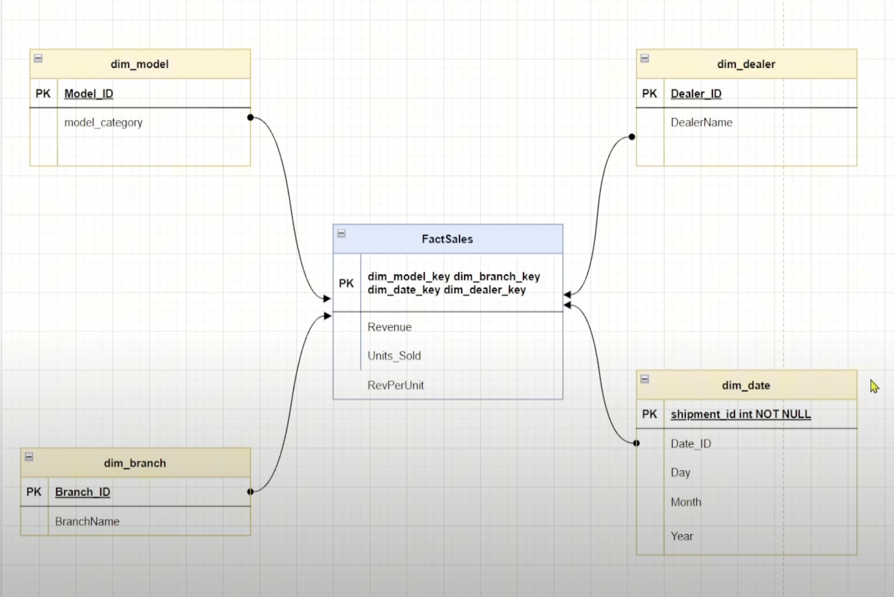

# Data Engineering Project with Azure Data Factory, Databricks, and PySpark  

## Project Overview  
This project demonstrates the implementation of a robust data pipeline utilizing cutting-edge technologies like **Azure Data Factory**, **Databricks**, and **PySpark**. The goal is to showcase effective data engineering practices, including data governance, efficient data storage, and real-world scenarios, to prepare for professional challenges in the field.  

## Key Features  
1. **Unity Catalog for Data Governance**  
   - Ensures secure and efficient management of metadata across the data pipeline.  
2. **Delta Lake and Delta Tables**  
   - Implements efficient data storage and processing using ACID-compliant Delta Lake for reliable data management.  
3. **Medallion Architecture**  
   - Structures data pipelines into **Bronze**, **Silver**, and **Gold** layers to ensure scalability and maintainability.  
4. **Dimensional Data Modeling**  
   - Explores best practices for designing fact and dimension tables in Azure Databricks.  
5. **Slowly Changing Dimensions (SCD)**  
   - Implements SCD techniques in Databricks for handling changing data over time.  
6. **Interview Preparation**  
   - Covers common interview questions and real-world scenarios to boost your job readiness in data engineering.  

## System Architecture  
The following diagram illustrates the overall system architecture for this project:  

  

## Pipeline Workflows  
### Azure Data Factory Pipeline  
This pipeline orchestrates the ingestion of data from various sources into the **Bronze layer**:  

  

### Databricks Pipeline  
This pipeline performs transformations and processes data through the **Silver** and **Gold layers**:  

  

## Data Model Schema  
The following schema outlines the structure of the data in this project, including the relationships between fact and dimension tables:  

 

## Technologies Used  
- **Azure Data Factory**: Orchestration and automation of data workflows.  
- **Azure Databricks**: Unified platform for data analytics and engineering.  
- **PySpark**: Distributed data processing and analysis.  
- **Delta Lake**: Reliable data lake storage with support for ACID transactions.  
- **Unity Catalog**: Data governance and secure access management.

## Project Workflow  
1. **Data Ingestion**:  
   - Use Azure Data Factory to pull data from multiple sources (APIs, databases, and flat files) into the **Bronze layer**.  
2. **Data Transformation**:  
   - Use Databricks and PySpark to clean, transform, and enrich data in the **Silver layer**.  
   - Apply Dimensional Data Modeling techniques during transformation.  
3. **Data Aggregation**:  
   - Process data into the **Gold layer** for analytics and reporting.  
   - Implement Delta Tables for efficient querying and updates.  
4. **Data Governance**:  
   - Leverage Unity Catalog to manage metadata, permissions, and security.  
5. **SCD Implementation**:  
   - Apply Slowly Changing Dimensions to manage historical data effectively. 
